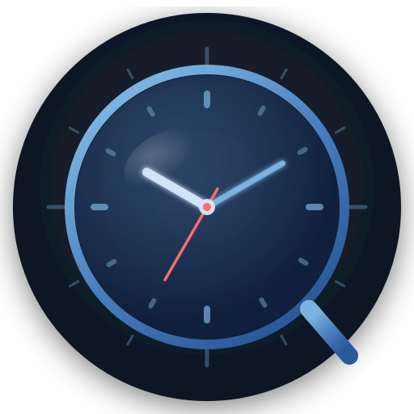

<div align="center">



**TimeLens, a lightweight screen time tracker & floating widget manager for your desktop**

[](https://github.com/PythonSmall-Q/TimeLens/actions/workflows/ci.yml)
[](https://github.com/PythonSmall-Q/TimeLens/releases)
[](LICENSE)
[](https://github.com/PythonSmall-Q/TimeLens/releases)

[简体中文](README_zh.md) · [English](#)

<a href="https://apps.microsoft.com/detail/9mvt208csf6p?referrer=appbadge&mode=full" target="_blank"  rel="noopener noreferrer">
	
</a>
</div>


---

## ✨ Features

- **Screen Time Tracking** — Automatically records foreground app usage with per-app daily totals, hourly distribution charts, 7-day trends, and a 365-day usage heatmap.
- **Insight Hub** — Discover "What Changed" between periods, identify distraction hotspots, and explore a unified timeline across desktop, browser, and interruptions.
- **Floating Widgets** — Transparent, frameless, always-on-top overlays: analog/digital clock, drag-reorder to-do list, multi-mode timer, sticky notes, habit tracker, and desktop pet.
- **Glassmorphic UI** — Dark-first design with backdrop blur, subtle transparency, and gradient accents throughout.
- **App Limits & Goals** — Set daily limits and productivity goals for apps or categories, with progressive notifications before you exceed them.
- **Focus Mode** — One-click focus sessions with automatic rules and deep-work time logging.
- **Browser & VS Code Integration** — Browser extension captures domain-level web usage; VS Code extension tracks coding time by language and project.
- **Third-party Widget SDK** — Open widget SDK v2 with permission matrix, audit logs, and a developer harness.
- **Data Health & Encrypted Backup** — Integrity checks, gap scans, orphaned-row cleanup, AES-256-GCM encrypted backups, and multi-profile isolation.
- **Local API Server** — Built-in API server with scoped tokens, allowlist, and rate limiting for widgets and external tools.
- **System Tray** — Minimize to tray; create new widgets, pause tracking, or quit from the tray menu.
- **Persistent Sessions** — Widget layouts and positions are restored on every launch via SQLite.
- **Multi-language** — Ships with 8 languages: `en`, `zh-CN`, `zh-TW`, `ja`, `ko`, `fr`, `de`, `es`; easily extensible (see [Adding a Language](#adding-a-language)).

---

## 🗺 Product Ecosystem

TimeLens is more than a desktop app — it's a screen-time platform with cross-tool integrations:

| Component | Path | Description |
| --------- | ---- | ----------- |
| **TimeLens Desktop** | `src/` + `src-tauri/` | Main Tauri + React application with tracking, insights, widgets, and settings. |
| **Browser Extension** | [`browser-extension/`](browser-extension/index.html) | Collects domain-level web usage and merges it with desktop stats. |
| **VS Code Extension** | [`vscode-extension/`](vscode-extension/index.html) | Tracks coding sessions by language, project, and workspace. |

---

## 🛠 Tech Stack

| Layer            | Technology                                 |
| ---------------- | ------------------------------------------ |
| Desktop shell    | [Tauri 2.x](https://tauri.app)                |
| UI framework     | React 18 + TypeScript 5                    |
| Styling          | Tailwind CSS 3.4 + glassmorphism utilities |
| State management | Zustand 4.5                                |
| Charts           | Recharts 2.12                              |
| i18n             | i18next + react-i18next                    |
| Widget DnD       | @dnd-kit/core + @dnd-kit/sortable          |
| Database         | SQLite via rusqlite (bundled)              |
| Build tool       | Vite 5                                     |

---

## 🚀 Quick Start

### Prerequisites

| Tool               | Version                                           |
| ------------------ | ------------------------------------------------- |
| Node.js            | ≥ 18                                             |
| Rust               | ≥ 1.77                                           |
| Tauri CLI          | 2.x (`cargo install tauri-cli --version "^2"`)  |
| WebView2 (Windows) | Bundled with Windows 11 / downloadable for Win 10 |
| Xcode (macOS)      | Latest stable                                     |

### Development

```bash
# 1. Clone
git clone https://github.com/PythonSmall-Q/TimeLens.git
cd TimeLens

# 2. Install frontend dependencies
npm install

# 3. Start dev server + Tauri window
npm run tauri:dev
```

### Production Build

```bash
npm run tauri:build
# Outputs:
#   Windows: src-tauri/target/release/bundle/msi/*.msi
#            src-tauri/target/release/bundle/nsis/*.exe
#   macOS:   src-tauri/target/release/bundle/dmg/*.dmg
```

### Release Publishing (v0.5.0 example)

```bash
# 1. Push master first (current repo convention)
git push origin refs/heads/master:refs/heads/master

# 2. Create and push the version tag
git tag -a v0.5.0 -m "release: v0.5.0"
git push origin v0.5.0
```

Notes: Pushing a `v*` tag triggers `.github/workflows/release.yml`.

---

## 🗂 Project Structure

```
TimeLens/
├── src/                        # React frontend
│   ├── components/             #   Shared UI components
│   ├── i18n/                   #   i18next config & locale files
│   ├── pages/                  #   Dashboard, WidgetCenter, Settings
│   ├── services/               #   Tauri command wrappers
│   ├── stores/                 #   Zustand state stores
│   ├── types/                  #   Shared TypeScript types
│   ├── utils/                  #   Formatting helpers
│   └── widgets/                #   Floating widget components
├── src-tauri/                  # Rust backend
│   ├── src/
│   │   ├── commands/           #   Tauri command handlers
│   │   ├── db/                 #   SQLite queries
│   │   ├── models/             #   Serde data structs
│   │   └── monitor/           #   Background window poller
│   ├── capabilities/           #   Tauri 2 permission manifests
│   ├── Cargo.toml
│   └── tauri.conf.json
├── .github/workflows/          # CI + release automation
└── docs/                       # Developer documentation
```

---

## 🧩 Widget Development

- [Widget Development Guide](docs/WIDGETS_DEV_GUIDE.md)
- [Third-party Widget Template](examples/third-party-widget-template/README.md)

---

## 🌐 Adding a Language

See [docs/ADD_LANGUAGE.md](docs/ADD_LANGUAGE.md) for a step-by-step guide.

---

## 🤝 Contributing

Please read [CONTRIBUTING.md](CONTRIBUTING.md) before submitting pull requests.

---

## 🗺 Roadmap

- [Unified Roadmap](docs/ROADMAP.md)
- [Widget Runtime Rewrite Roadmap (Proposed)](docs/ROADMAP_WIDGET_RUNTIME_REWRITE.md)
- [Widget Runtime Rewrite Implementation Plan (Draft)](docs/WIDGET_RUNTIME_REWRITE_IMPLEMENTATION_PLAN.md)

---

## 📋 Changelog

See [CHANGELOG.md](CHANGELOG.md).

---

## 📄 License

MIT © 2026 TimeLens Contributors


---

LLM Supported by OrcaRouter！

[](https://www.orcarouter.ai/ref/ref_2bd137bce0d730edcd93)